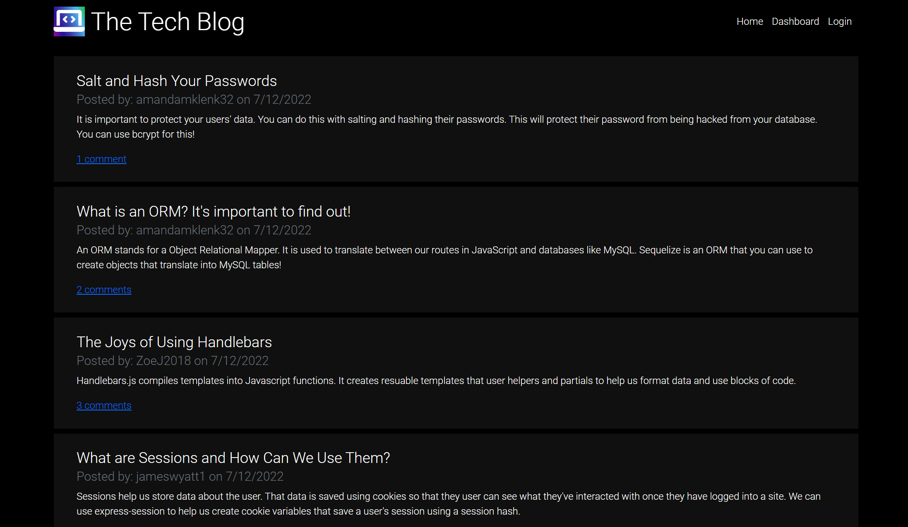
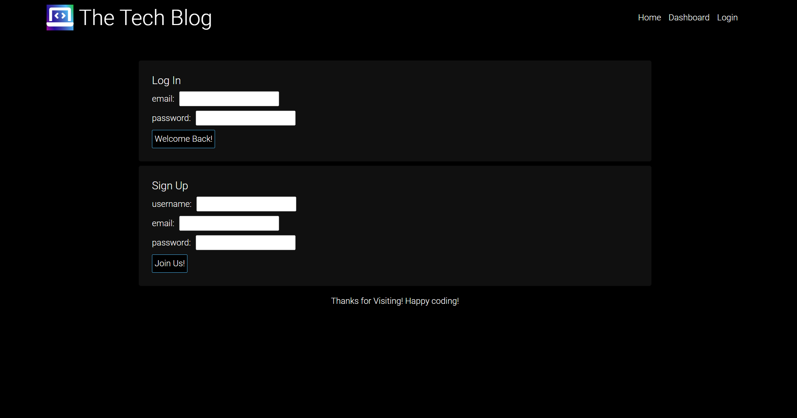
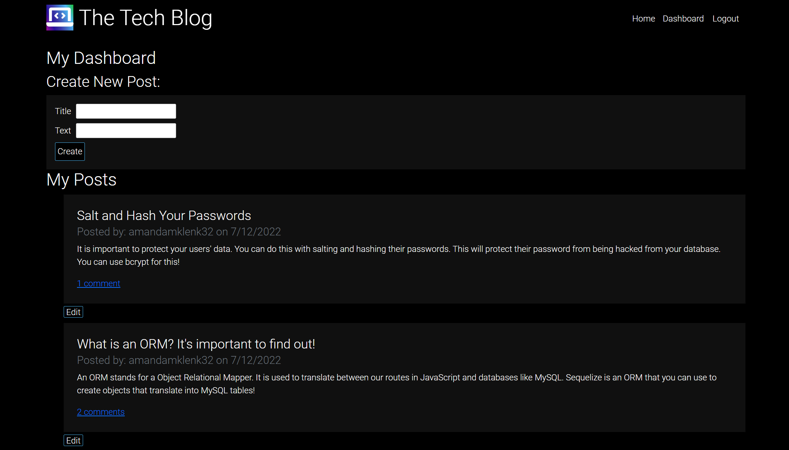
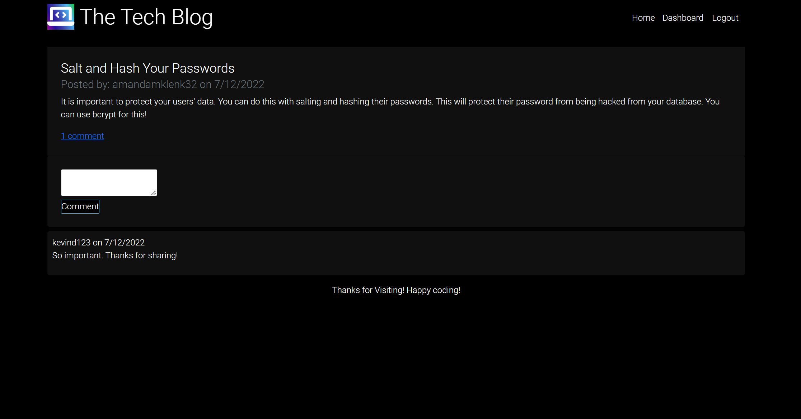
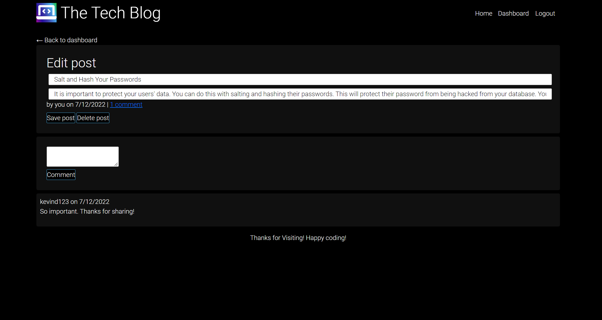

# Tech-Blog


## Description
This application is meant to createsa blog site for a developer so that they can publish articles, blog posts, and their thoughts and opinions via comments. The following were the requirements of the application: 

* When the user visits thesite, they are presented with the homepage, which includes existing blog posts if any have been posted; navigation links for the homepage and the dashboard; and the option to log in. 
* When the user clicks on the homepage option,they are taken to the homepage.
* When the user clicks on any other links in the navigation, they are prompted to either sign up or sign in.
* When the user chooses to sign up, they are prompted to create a username and password.
* When the user clicks on the sign-up button, their user credentials are saved and they are logged into the site.
* When the user revisits the site at a later time and chooses to sign in, they are prompted to enter their username and password.
* When the user is signed in to the site,the user will see the navigation links for the homepage, the dashboard, and the option to log out.
* When the user clicks on the homepage option in the navigation, they are taken to the homepage and presented with existing blog posts that include the post title and the date created.
* When the user clicks on an existing blog post, they are presented with the post title, contents, post creator’s username, and date created for that post and have the option to leave a comment.
* When the user enters a comment and clicks on the submit button while signed in, then the comment is saved and the post is updated to display the comment, the comment creator’s username, and the date created.
* When the user clicks on the dashboard option in the navigation, then they are taken to the dashboard and presented with any blog posts that they have already created and the option to add a new blog post.
* When the user clicks on the button to add a new blog post, they are prompted to enter both a title and contents for their blog post.
* When the user clicks on the button to create a new blog post, the title and contents of their post are saved and they are taken back to an updated dashboard with their new blog post.
* When the user clicks on one of their existing posts in the dashboard,they are able to delete or update their post and taken back to an updated dashboard.
* When the user clicks on the logout option in the navigation, they are signed out of the site.
* When the user is idle on the site for more than a set time
THEN I am able to view comments but I am prompted to log in again before I can add, update, or delete comments.

## Table of Contents
- [Installation](#installation)
- [Links](#links)
- [Usage](#usage)
- [License](#license)
- [How to Contribute](#how-to-contribute)
- [Questions](#questions)

## Installation
Visit the GitHub repository, Tech-Blog (see the link below), to fork and clone the repository. The JSON file will have the necessary dependencies. Use:
````````````
npm install
````````````
The .gitignore file is set up in the root directory along with the server.js file that contains the code to run the server. The sequelize sync in server.js should be set to
````````````````
{ force: false }
````````````````
, unless the user wants to drop and recreate their database. The seeds directory contains all of the data to populate the table. The user will need to use:
`````````````
npm run seed
`````````````
To populate the tables. 
* The __tests__ directory contains the testing for the helper functions. 
* The config file contains the connection.js file so that any user can connect to their database using .env variables. The user will need to create a .env file and use the code described in the Usage section to login to their MySQL account and run the application. They will need to add .env to their .gitignore file so that their password is not pushed to GitHub.
* The controllers directory contains the index.js file, the home and dashboard routes files for the front-end routes, and the api directory. The index.js file that is not in the api directory is the routing page for all of the routes. Within the api directory in the routes directory, there is an index.js (which routes all of the api routes) and files that contain the routes to get, post, put, and delete data about the users, posts, and comments to the database.
* The db directory contains the schema.sql file that allows the user to drop and create the database.
* The models directory contains an index.js file (which details and exports the table associations) and the JS files to set up the models for the user, post, and comment tables in MySQL using Sequelize.
* The public directory contains the front-end logic for each of the Handlebars template pages.
* The seeds directory contains the seeding JS files and the index.js file that contains the seeding logic.
* The utils directory contains the helpers and auth js files to run the helper functions and the user authorizing function.
* The views directory contains the layouts and partial directories along with the handlebars files for the site's pages. The layouts directory contains the main.handlebars file to serve as a template for the other pages. The partials directory contains the partials for repeated post and comment code blocks.

## Links
- [GitHub Repo](https://github.com/amklenk/Tech-Blog)
- [Heroku Deployed Site](https://desolate-temple-87705.herokuapp.com/)

## Usage
The following are screenshots of the deployed Heroku site:

The homepage:


The login page:


The dashboard page, after logging in:


A single-post page (logged in):


An edit-post page (logged in): 



Before starting the application, the user needs to create a .env file in their root directory to connect to their local MySQL database. They will need to put the following code in their .env file, filling in their own data for the values:

``````````````````````````````
DB_NAME="user's database"
DB_USER="root"
DB_PASSWORD="userpasswordhere"
``````````````````````````````

The application can be accessed via the backend using Insomnia. The application can be accessed via the front-end by turning on the server and visiting localhost:3001/ or by visiting the Heroku app, see Links for the site link.

## License
The badge at the top of the page shows that this project is licensed under MIT. The link for that license is shown below.
- [License: MIT](https://opensource.org/licenses/MIT)
## How to Contribute
Please fork and clone the repository and use a pull request to add or make changes to the current repository.

## Questions
Please direct any questions to amandamklenk3@gmail.com. To see more projects, visit the link below for amklenk's respository:
- [GitHub Repository](https://github.com/amklenk)


